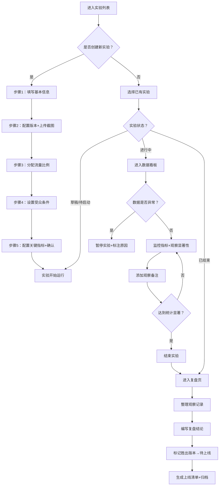

# A/B 测试平台 - 产品需求文档 (PRD)

## 1. 产品概述

面向增长团队、产品经理和运营人员的一站式 A/B 实验管理平台。提供从实验创建、流量分配、指标追踪、数据看板到复盘决策的全流程管理能力，帮助团队用数据驱动产品迭代。

- 解决问题：告别 Excel 和零散脚本，集中管理所有增长实验，标准化实验流程，提升决策效率
- 目标用户：增长黑客、产品经理、数据分析师、运营专家
- 核心价值：缩短实验周期，降低决策风险，让每个改版都有数据支撑

---

## 2. 核心功能

### 2.1 用户角色

| 角色 | 说明 | 核心权限 |
|------|------|----------|
| 实验管理员 | 增长团队负责人 | 创建/编辑/暂停实验、管理受众、审批复盘结论 |
| 产品经理 | 产品负责人 | 发起实验、查看数据、添加观察备注 |
| 数据分析师 | 数据团队 | 配置指标、分析显著性、生成复盘报告 |
| 运营人员 | 运营执行 | 查看实验结果、标记待上线版本 |

### 2.2 功能模块

1. **实验列表页**：全局实验概览，支持状态筛选、搜索、快捷操作
2. **创建向导**：多步骤实验创建流程，引导用户完成所有配置
3. **数据看板**：实时数据可视化，核心指标对比、转化漏斗、显著性检验
4. **受众管理**：用户分群配置，人群条件组合、流量比例分配
5. **复盘页**：实验结论沉淀，胜出版本标记，观察备注整理

### 2.3 页面详情

| 页面名称 | 模块名称 | 功能描述 |
|----------|----------|----------|
| 实验列表页 | 顶部导航栏 | 全局搜索、创建实验按钮、用户菜单 |
| 实验列表页 | 状态筛选栏 | 全部/进行中/已暂停/已完成/草稿 五个 Tab 切换 |
| 实验列表页 | 统计概览卡片 | 实验总数、进行中、胜出版本、待上线四个核心指标 |
| 实验列表页 | 实验卡片列表 | 每个卡片展示名称、目标、状态、进度条、版本数、起止时间、操作按钮 |
| 创建向导 | 步骤指示器 | 5 个步骤：基本信息 → 版本配置 → 流量分配 → 受众条件 → 确认创建 |
| 创建向导 | 基本信息表单 | 实验名称、实验目标、实验描述、所属页面、开始/结束时间 |
| 创建向导 | 版本配置区 | 版本名称、版本说明、页面截图上传、原始版本 vs 变体对比 |
| 创建向导 | 流量分配器 | 拖拽滑块配置各版本流量比例，确保总和为 100% |
| 创建向导 | 受众条件配置 | 条件组合（地区/设备/用户属性/自定义标签），支持 AND/OR 逻辑 |
| 创建向导 | 关键指标选择 | 核心指标（点击率/转化率/停留时长/GMV 等）配置 |
| 数据看板 | 实验信息头 | 状态标签、运行天数、覆盖人数、统计显著性状态 |
| 数据看板 | 核心指标对比卡片 | 多版本横向对比，展示数值、变化率、置信区间、显著性标签 |
| 数据看板 | 转化漏斗图 | 多步骤转化漏斗，对比各版本流失率 |
| 数据看板 | 趋势折线图 | 按日/周展示各版本核心指标走势 |
| 数据看板 | 操作区 | 暂停实验、标注异常、添加备注按钮 |
| 受众管理 | 受众列表 | 已保存人群分群，展示名称、条件摘要、覆盖用户数 |
| 受众管理 | 分群创建表单 | 条件组合器、实时预估覆盖人数、保存为模板 |
| 复盘页 | 复盘摘要头 | 实验名称、结论状态、胜出版本、统计置信度 |
| 复盘页 | 核心发现区 | 关键指标对比表、显著性结论说明 |
| 复盘页 | 观察备注时间线 | 团队成员添加的观察记录，按时间倒序排列 |
| 复盘页 | 复盘结论编辑器 | Markdown 富文本编辑器，填写结论、经验、风险 |
| 复盘页 | 标记待上线 | 将胜出版本标记为「待上线」，生成上线清单 |

---

## 3. 核心流程

### 3.1 主流程描述

用户登录后进入实验列表，查看当前所有实验状态。点击「创建实验」进入五步向导，填写基本信息、配置版本和截图、分配流量、设置受众条件和关键指标后提交。实验进行中，用户在数据看板实时监控各版本数据和显著性，发现异常可暂停。实验结束后，在复盘页整理观察备注、生成结论、标记胜出版本为待上线。

### 3.2 流程图

---

## 4. 用户界面设计

### 4.1 设计风格

**美学方向：高端数据仪表盘美学（Data Dashboard Aesthetic）**

- **主色调**：深邃墨绿 `#0f2e2e` 作为背景底色，搭配翡翠绿 `#10b981` 作为主色（代表增长、正向）
- **辅助色**：琥珀橙 `#f59e0b` 表示警告/关注，绯红 `#ef4444` 表示负向/异常，石板蓝 `#6366f1` 表示中性信息
- **按钮风格**：圆角胶囊形（radius 9999px），主按钮实心渐变，次按钮描边+悬浮填充
- **字体**：展示字体用 `Fraunces`（衬线、高端、学术感），数据数字用 `JetBrains Mono`（等宽、清晰、科技感），正文用 `DM Sans`（现代、易读）
- **布局风格**：卡片式栅格布局，左侧导航栏（可折叠），主内容区 12 列栅格
- **图标风格**：Lucide 线性图标，统一 2px 描边，搭配 1px 高光
- **视觉特效**：玻璃拟态卡片（backdrop-blur）、悬浮微阴影、数据图表渐变色填充

### 4.2 页面设计概览

| 页面名称 | 模块名称 | UI 设计细节 |
|----------|----------|-------------|
| 实验列表页 | 统计概览卡片 | 四张渐变背景卡片（绿/蓝/紫/橙），大字号数字 + Fraunces 斜体指标名，底部迷你趋势折线 |
| 实验列表页 | 实验卡片 | 白色/深灰卡片，顶部状态胶囊标签，中部两行信息，底部进度条 + 操作按钮 |
| 创建向导 | 步骤指示器 | 左侧垂直时间轴，已完成步骤打钩翡翠绿，当前步骤发光圆圈 |
| 创建向导 | 表单区域 | 分组折叠面板，输入框聚焦时有翡翠绿外发光 |
| 创建向导 | 版本截图预览 | 3D 透视卡片悬浮效果，鼠标悬停轻微放大 + 阴影加深 |
| 数据看板 | 核心指标对比 | 多列横向卡片，数值用 JetBrains Mono 特大字号，显著性用三角符号 ▲▼ 标色 |
| 数据看板 | 转化漏斗 | 阶梯式彩色条形图，每段之间有流失率百分比标注 |
| 数据看板 | 趋势图 | 面积图，两种版本不同渐变色填充，交叉点高亮标注 |
| 复盘页 | 观察时间线 | 左侧竖线 + 圆点，右侧卡片带用户头像 + 时间戳 + 内容 |
| 复盘页 | 结论编辑器 | 左侧工具栏 + 右侧编辑区，Markdown 实时预览 |

### 4.3 响应式设计

- **桌面优先**：1440px 基准设计，12 列栅格，侧边栏 240px 固定
- **平板适配（1024px）**：侧边栏折叠为 64px 图标模式，10 列栅格
- **手机适配（428px）**：侧边栏变底部 Tab 栏，单列流式布局，卡片全屏宽度

---
