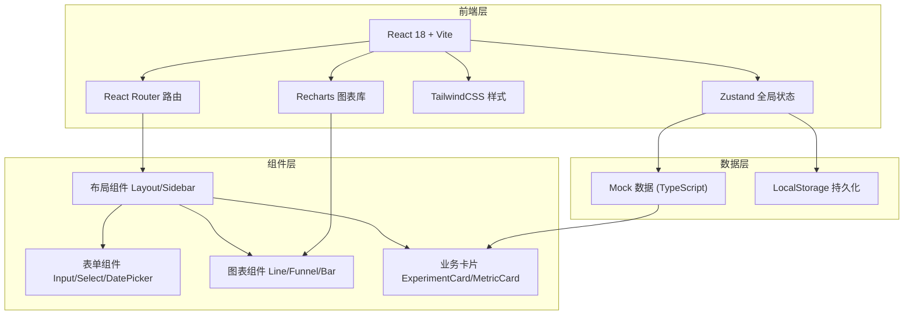

# A/B 测试平台 - 技术架构文档

## 1. 架构设计



---

## 2. 技术描述

- **前端框架**：React@18 + TypeScript@5
- **构建工具**：Vite@5（极速冷启动 + HMR）
- **路由管理**：React Router Dom@6
- **状态管理**：Zustand@4（轻量、简洁、支持持久化中间件）
- **样式方案**：TailwindCSS@3.4 + CSS Variables（主题系统）
- **UI 组件库**：自研组件 + Lucide React@0.400（图标）
- **图表可视化**：Recharts@2（React 原生图表库，支持自定义样式）
- **表单处理**：React Hook Form@7 + Zod（类型安全校验）
- **富文本**：React Markdown + 自定义编辑器组件
- **Mock 数据**：TypeScript 类型定义 + 静态数据文件，模拟真实业务数据
- **持久化**：LocalStorage 保存用户操作（草稿、备注、标记状态）

---

## 3. 路由定义

| 路由路径 | 页面名称 | 说明 |
|----------|----------|------|
| `/` | 实验列表页 | 默认首页，展示所有实验概览 |
| `/experiments` | 实验列表页 | 同上，可带 status/search 查询参数 |
| `/experiments/create` | 创建向导页 | 多步骤实验创建流程 |
| `/experiments/:id/dashboard` | 数据看板页 | 实验详情数据可视化 |
| `/audiences` | 受众管理页 | 人群分群列表和配置 |
| `/experiments/:id/review` | 复盘页 | 实验复盘结论和胜出版本标记 |

---

## 4. 数据模型

### 4.1 实体关系图 (ER Diagram)

```mermaid
erDiagram
    EXPERIMENT ||--o{ VARIANT : has
    EXPERIMENT ||--o{ METRIC : tracks
    EXPERIMENT ||--o{ OBSERVATION : has
    EXPERIMENT ||--o{ AUDIENCE_CONDITION : targets
    EXPERIMENT }o--|| AUDIENCE : uses
    EXPERIMENT ||--o|| REVIEW : concludes
    VARIANT ||--o{ DAILY_DATA : generates
    METRIC ||--o{ DAILY_DATA : has

    EXPERIMENT {
        string id PK
        string name
        string goal
        string description
        string page_url
        enum status
        datetime start_time
        datetime end_time
        string created_by
        datetime created_at
        string winner_variant_id FK
        string review_id FK
    }

    VARIANT {
        string id PK
        string experiment_id FK
        string name
        string description
        string screenshot_url
        number traffic_percent
        boolean is_control
        number visitors
        number conversions
    }

    METRIC {
        string id PK
        string experiment_id FK
        string name
        enum type
        boolean is_primary
        string formula
    }

    DAILY_DATA {
        string id PK
        string variant_id FK
        string metric_id FK
        date date
        number value
        number visitors
        number conversions
    }

    AUDIENCE {
        string id PK
        string name
        string description
        number estimated_users
        json conditions
    }

    AUDIENCE_CONDITION {
        string id PK
        string experiment_id FK
        enum field
        enum operator
        string value
        enum logic
    }

    OBSERVATION {
        string id PK
        string experiment_id FK
        string author
        datetime timestamp
        string content
        enum type
    }

    REVIEW {
        string id PK
        string experiment_id FK
        string conclusion
        string winner_reason
        string lessons_learned
        string risks
        boolean is_published
        string author
        datetime published_at
    }
```

### 4.2 类型定义 (TypeScript)

```typescript
// 实验状态
type ExperimentStatus = 'draft' | 'running' | 'paused' | 'completed' | 'archived';

// 版本信息
interface Variant {
  id: string;
  experimentId: string;
  name: string;
  description: string;
  screenshotUrl?: string;
  trafficPercent: number;
  isControl: boolean;
  visitors: number;
  conversions: number;
  conversionRate: number;
}

// 指标类型
type MetricType = 'conversion_rate' | 'ctr' | 'dwell_time' | 'gmv' | 'revenue_per_user';

interface Metric {
  id: string;
  experimentId: string;
  name: string;
  type: MetricType;
  isPrimary: boolean;
}

// 受众条件
type ConditionField = 'country' | 'device' | 'user_type' | 'custom';
type ConditionOperator = 'eq' | 'neq' | 'in' | 'not_in' | 'contains';
type ConditionLogic = 'AND' | 'OR';

interface AudienceCondition {
  id: string;
  field: ConditionField;
  operator: ConditionOperator;
  value: string | string[];
  logic: ConditionLogic;
}

// 显著性检验结果
interface SignificanceResult {
  metricId: string;
  controlValue: number;
  variantValue: number;
  liftPercent: number;
  confidenceInterval: [number, number];
  pValue: number;
  isSignificant: boolean;
  confidence: number;
}

// 实验主实体
interface Experiment {
  id: string;
  name: string;
  goal: string;
  description: string;
  pageUrl: string;
  status: ExperimentStatus;
  startTime: string;
  endTime: string;
  createdBy: string;
  createdAt: string;
  variants: Variant[];
  metrics: Metric[];
  audienceConditions: AudienceCondition[];
  audience?: Audience;
  winnerVariantId?: string;
}

// 观察备注
type ObservationType = 'note' | 'anomaly' | 'insight';

interface Observation {
  id: string;
  experimentId: string;
  author: string;
  authorAvatar?: string;
  timestamp: string;
  content: string;
  type: ObservationType;
}

// 复盘结论
interface Review {
  id: string;
  experimentId: string;
  conclusion: string;
  winnerReason: string;
  lessonsLearned: string;
  risks: string;
  isPublished: boolean;
  author: string;
  publishedAt?: string;
  isWinnerReadyToLaunch: boolean;
}
```

---

## 5. 目录结构

```
src/
├── assets/              # 静态资源（字体、图片）
├── components/          # 通用组件
│   ├── layout/         # 布局组件（Sidebar, Header, PageContainer）
│   ├── ui/             # 基础 UI（Button, Input, Select, Card, Modal）
│   ├── charts/         # 图表组件（LineChart, FunnelChart, BarChart）
│   └── business/       # 业务组件（ExperimentCard, MetricCard, StepIndicator）
├── pages/              # 页面级组件
│   ├── ExperimentList/
│   ├── CreateWizard/
│   ├── Dashboard/
│   ├── Audience/
│   └── Review/
├── store/              # Zustand 状态管理
│   ├── useExperimentStore.ts
│   ├── useAudienceStore.ts
│   └── useReviewStore.ts
├── types/              # TypeScript 类型定义
│   └── index.ts
├── data/               # Mock 数据
│   ├── experiments.ts
│   ├── audiences.ts
│   └── dailyMetrics.ts
├── utils/              # 工具函数
│   ├── statistics.ts   # 显著性检验等统计函数
│   ├── format.ts       # 格式化（百分比、日期、货币）
│   └── mock.ts         # 随机数据生成
├── hooks/              # 自定义 Hooks
├── App.tsx
├── main.tsx
├── index.css           # Tailwind 入口 + 自定义样式
└── router.tsx          # 路由配置
```

---

## 6. 关键技术实现点

1. **流量分配验证**：实时校验各版本流量总和必须等于 100%，使用带约束的滑块组件
2. **显著性检验算法**：实现比例 Z 检验（Z-test for proportions），计算 p-value 和置信区间
3. **条件组合器**：支持 AND/OR 嵌套逻辑，动态添加/删除条件行，实时预估覆盖人数
4. **实时数据模拟**：基于时间戳生成每日增量数据，模拟真实实验走势
5. **多步骤表单持久化**：Zustand persist 中间件保存创建向导进度，刷新不丢失
